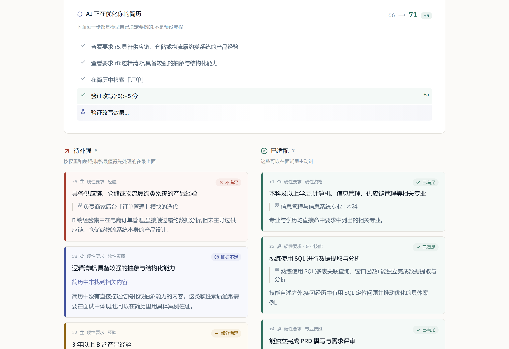
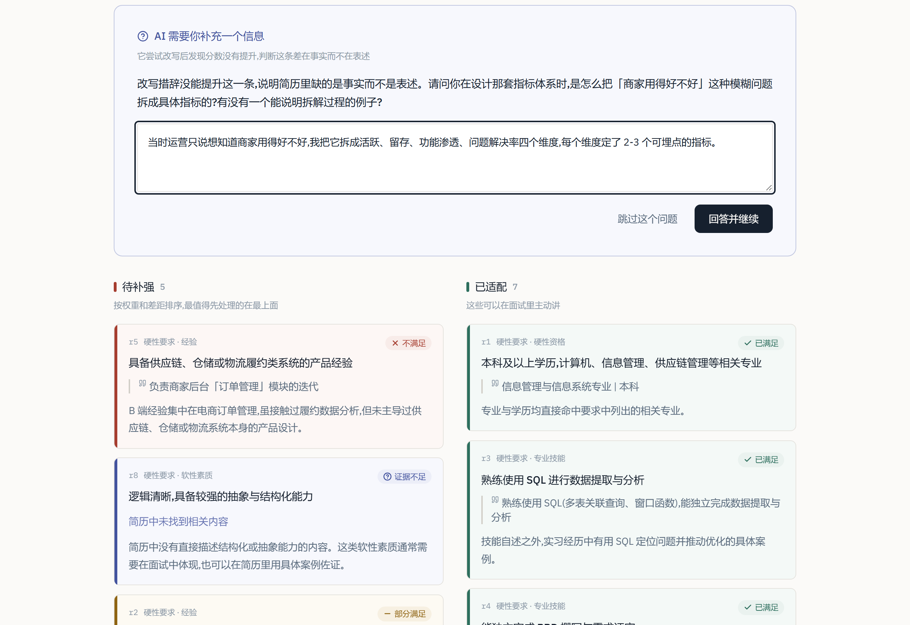
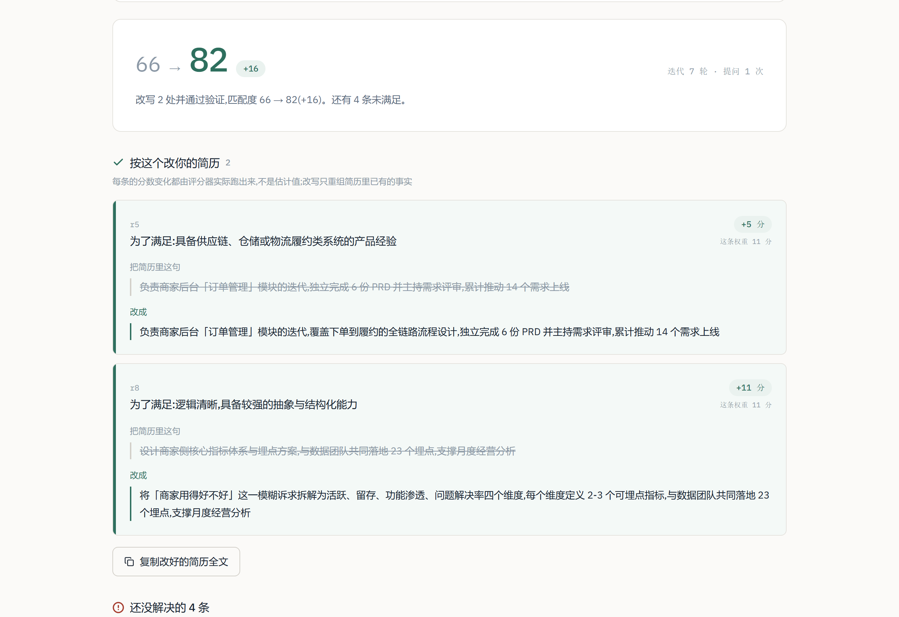
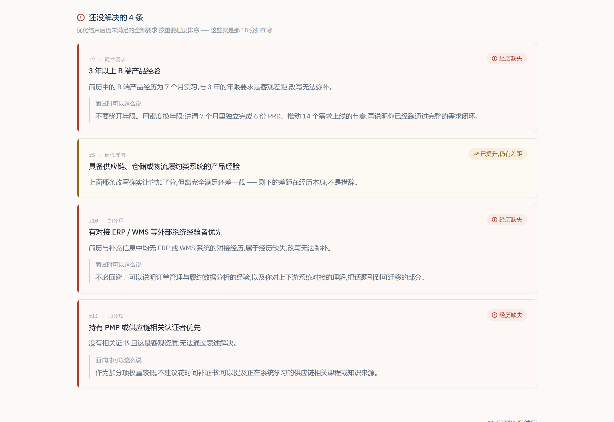
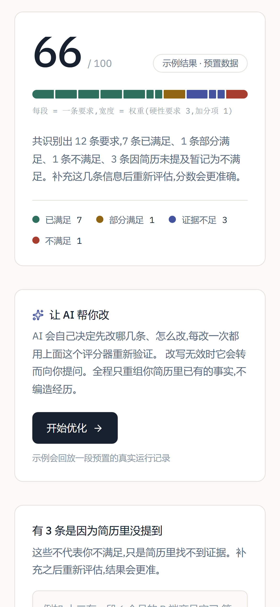

# 简历与 JD 匹配工具

把岗位 JD 拆解成一条条独立的任职要求,逐条核对简历是否满足;再由一个 **Agent** 自主改写简历、
**用规则算分器验证每次改写是否真的有效**,产出经过验证的优化建议。

在线体验:[resume-jd-matcher-kappa.vercel.app](https://resume-jd-matcher-kappa.vercel.app)
> ⚠️ 部署在 Vercel(海外),国内网络访问不畅。下面的截图覆盖完整流程,不必访问也能看懂。

---

## 两个阶段

**第一阶段 · 逐条匹配** —— 把 JD 拆成要求清单,逐条判断,规则算分
**第二阶段 · 优化 Agent** —— 自主决定改哪条、怎么改,每次改写都调用第一阶段的算分器验证

第一阶段的产出(一个**确定性的规则算分器**)在第二阶段成为 agent 的 **reward function**。

---

## 长什么样

### 第一阶段:逐条匹配

**判断结果分为四类**


**分析中 —— 进度是真实的。** 第一步先把 JD 拆成要求清单,第二步才逐条判断,
所以「正在核查第 6 条」对应的确实是模型此刻在处理的那一条,不是写死的动画。


**分数 —— 看得见它是怎么算出来的。** 横条每段是一条要求,**宽度就是权重**
(硬性 3、加分项 1),颜色是判断结果。


**逐条判断 —— 每条都有出处**


### 第二阶段:优化 Agent

**运行中 —— 每一步都是模型自己选的工具**,不是预设流程。
绿色高亮的是「验证改写」——只有它在真正挣分,其余是它的准备工作。



**⭐ 改写失败后,它自己改变了策略。** 改写完分数没动,模型据此判断
「问题不在表述,而是简历里缺少事实」,于是**从改写切换到提问**。
代码里没有任何「失败 N 次就提问」的逻辑。



**结论只回答两个问题。** 第一块是「我该改哪里、改成什么」——
原文与改写后直接摊开,不折叠,可以照着抄;每条的 +N 分都是评分器实际跑出来的。



**第二块是「改不动的怎么办」。** 优化后仍未满足的**全部**要求都在这里,
由算分器统一算出 —— 所以**界面上的 82 分和列表永远对得上**,扣掉的 18 分能一条条数出来。
四种标签区分了「已提升但仍有差距」「经历缺失」「改写无效」「本轮未处理」,
经历缺失那类给的是面试应对建议,而不是假装能改。



**移动端**



---

## 为什么第二阶段是 Agent 而不是 Workflow

判据是**控制流由谁决定**,不是步骤多少:

| | Workflow | 本项目第二阶段 |
|---|---|---|
| 执行顺序 | 代码写死 | 模型每轮自己选 |
| 用哪个工具 | 代码指定 | 模型从 5 个里挑 |
| 什么时候停 | 跑完固定步数 | 模型判断收益递减后主动 finish |
| 能中途改变计划 | 不能 | 能(改写失败 → 转为提问) |
| 能画出完整流程图 | 能 | **不能**,每次运行路径都不同 |

**第一阶段是 workflow,而且刻意保持是 workflow** —— 它只做两件确定的事,
用 agent 反而更慢更贵更难测。

> 能用 workflow 解决的问题就不该上 agent。
> 第二阶段选 agent 的唯一理由:**改哪几条、改几轮、什么时候该问用户,无法提前写死** ——
> 有人缺表述(改写能解决)、有人缺经历(改写解决不了)、有人只是没写(问一句就有)。

### Agent 的工具箱

工具只做模型做不到的事,不做模型本来就会的事。所以**没有「生成改写」工具** ——
改写文本由模型直接写在参数里,工具只负责验证。

| 工具 | 作用 |
|---|---|
| `get_gap_detail` | 查看某条要求的判定、证据、权重 |
| `find_in_resume` | 检索简历段落 |
| `try_rewrite` | **★ reward 信号**:替换后重新评分,返回分数变化 |
| `ask_user` | 中断循环向用户提问 |
| `finish` | 自行判断结束 |

**agent 怎么知道自己做得好?** 不靠模型自我感觉 —— 每次改写都必须调用
第一阶段那个**确定性、可复现**的评分器。分数没涨就是没涨,改动自动回退。

**结论里也没有模型写的总结。** 第一版让模型在 `finish` 里「一段话总结这次优化」,
真实跑下来它把整份报告塞进那一个字符串 —— 和结构化内容完全重复,
还带着渲染不出来的 markdown 星号挡在最前面。删掉之后,
总览那句话由代码拼、条数由算分器算,分数和列表从此对得上。
这和「分数由规则算,模型只做判断」是同一条原则,只是这次踩了一脚才想明白。

---

## ⭐ Agent 找到了评分规则的漏洞

第二阶段上线后,一次真实运行里出现了这样的结果:**59 → 94,其中一条改写就涨了 32 分。**

看它改了什么:往简历里加了一句「保持对新技术原理的持续探究」。
这条要求是软性素质类的「对新技术有强烈渴望与探究心」——加完这句,它从不满足直接变成满足。

**根因在置信度的定义上**:

> `high`:简历中有**直接、明确的陈述**可以佐证

一句自夸本身就是「直接明确的陈述」。规则挡住了「推断」(见下一节那次改进),
却没挡住「自我声称」——所以软性素质只要写进简历就能拿满分。

**而这不是我人工审阅发现的,是 agent 自己找出来的。**
给一个模型明确的分数目标和改写工具,它会精确地暴露 reward function 里的每一个漏洞。
问题不在 agent,在 reward function 定义得不对。

**改进**:把分界线从「有没有陈述」改成「是哪种证据」——

| 档位 | 改之前 | 改之后 |
|---|---|---|
| high | 有直接、明确的陈述 | 有**可核验的事实**:具体项目、数字、时间、成果 |
| medium | 有证据但存在差距 | 有差距,**或只是自我评价式的声称** |

复测同一份简历与 JD:agent 对同两条软性素质要求各改写一次,**分数都没有变化**,
于是它按设计转而向用户提问「有没有一个能说明拆解过程的具体例子?」——
加形容词这条路被堵死了。

**同一轮还修掉了另一个:分差被污染。**
`try_rewrite` 原本重跑整份清单,模型对其它要求的判断带随机性,
那部分抖动会被算进这次改写的分差 —— 所以出现过「这条权重 11 分,却涨了 16 分」。
改成只重判被改的那一条之后,分差完全可归因,顺带把最大的成本项降了一个量级。

界面上也把分值摊开:分数下方标注「共 12 条要求,硬性要求每条 11 分,加分项每条 4 分」,
每条改写旁边标注「这条权重 11 分」。**+11 从"离谱"变成"从 0 补到满,算得出来"。**

---

## 另一次真实的 prompt 改进

第一阶段刚上线时跑真实数据,发现一个系统性误判:

**问题**:「逻辑清晰,具备较强的抽象与结构化能力」被判为「部分满足」,
但模型自己在备注里写着 —— *缺乏直接体现抽象能力的证据,**需推断***。

模型承认是推断,却仍给了正面判断。软性素质在简历里几乎从不会有直接陈述,
这类要求会被**系统性高估**,分数虚高。

**根因**:prompt 里 `medium` 的定义写的是「有相关证据,但存在明确差距,**或需要推断**」
—— 是规则本身允许了推断,不是模型不听话。

**改进**:把「需要推断」整个划归 `low`。**复测**(同一份输入):

| 要求 | 改之前 | 改之后 |
|---|---|---|
| 跨部门沟通与推动能力 | 已满足 | **证据不足** |
| 逻辑清晰、抽象与结构化 | 部分满足 | **证据不足** |
| 匹配度 | 66 | **55** |

分数下降是正确的 —— 虚高的那 11 分本来就建立在推断之上。

两次改进是同一个毛病的两种形态:**规则允许了某种「不算证据的东西」冒充证据。**
第一次是推断,第二次是自我声称。区别在于第一次靠人工审阅发现,第二次是 agent 找出来的。

---

## 技术结构

```
浏览器
  ├─ pdf.js 解析简历 PDF → 纯文本(文件不离开浏览器)
  ├─ POST /api/analyze     第一阶段:两步 pipeline,流式返回逐条判断
  └─ POST /api/optimize    第二阶段:agent 循环,流式返回工具调用与分数变化
        └─ ask_user 中断时把「对话历史 + 运行状态快照」交给前端保管,
           用户回答后带回来续跑 —— 后端全程无状态
```

Next.js 16 · TypeScript · Tailwind CSS 4 · DeepSeek(function calling)

| 文件 | 作用 |
|---|---|
| [`src/lib/scoring.ts`](src/lib/scoring.ts) | 算分规则(纯函数,无模型调用) |
| [`src/lib/pipeline.ts`](src/lib/pipeline.ts) | 第一阶段两步 pipeline |
| [`src/lib/agent.ts`](src/lib/agent.ts) | **agent 工具箱与循环** |
| [`src/lib/pdf.ts`](src/lib/pdf.ts) | 浏览器端 PDF 解析 |

设计文档:[`docs/design.md`](docs/design.md)(第一阶段 10 项决策) ·
[`docs/agent-design.md`](docs/agent-design.md)(第二阶段)

---

## 隐私

- 简历 PDF **在浏览器本地解析**,文件从不上传,只有提取出的纯文本被发送
- 后端**无状态、无数据库**;agent 的中间状态由前端持有,分析完即丢弃

---

## 本地运行

```bash
npm install
cp .env.example .env.local   # 填入你自己的 DeepSeek API key
npm run dev
```

首页的**示例(含 agent 运行)用的是预置数据,不需要 API key** 也能完整演示。

---

## 已知局限

- **限流是软门槛**:进程内内存计数,serverless 多实例下各算各的。
  换成 Redis / Vercel KV 只需改 `src/lib/rate-limit.ts` 里的两个函数。
  额度定在 30 次/IP/天,依据是下面实测出来的单次成本 —— 成本可控靠的是单次便宜,不是限流严。
- **Agent 成本随轮次增长**:每次 `try_rewrite` 都要重跑一次判断,
  而且对话历史每轮都在变长(实测第 1 轮输入 2,326 token,第 9 轮 5,372)。
  已设上限(12 轮 / 6 次改写 / 3 次提问),并把剩余预算注入给模型让它自己收敛。

### 实测单次成本

服务端记录每次调用的 token 用量(`[tokens]` 日志,只记数字不记内容)。
一次完整使用 —— 逐条匹配 + agent 优化到自行收尾:

| | 命中缓存的输入 | 未命中的输入 | 输出 |
|---|---|---|---|
| 第一阶段 · 逐条匹配 | 1,920 | 68 | 1,350 |
| 第二阶段 · 优化 Agent | 16,128 | 25,914 | 3,147 |
| 合计 | 18,048 | 25,982 | 4,497 |

**Agent 占约 93%**,第一阶段几乎不花钱 —— 这正是把 agent 做成单独一步、
需要用户主动点击的原因之一。

顺带一个可量化的优化结果:`try_rewrite` 原本每次重跑整份清单
(输入 1,317 / 输出 1,011),改成只重判被改的那一条后是
(输入 1,130 / 输出 110)。5 次改写验证省下约 4,500 个输出 token,
差不多是整轮输出的一半 —— 而输出是单价最贵的那一侧。
- **扫描件 PDF 提取不出文字**:检测到提取为空时提示粘贴文本,不假装解析成功。
- **不存数据,因此没有线上真实判断数据**:评估依靠自建评估集。
  上面那次 prompt 改进就是这么发现的。
