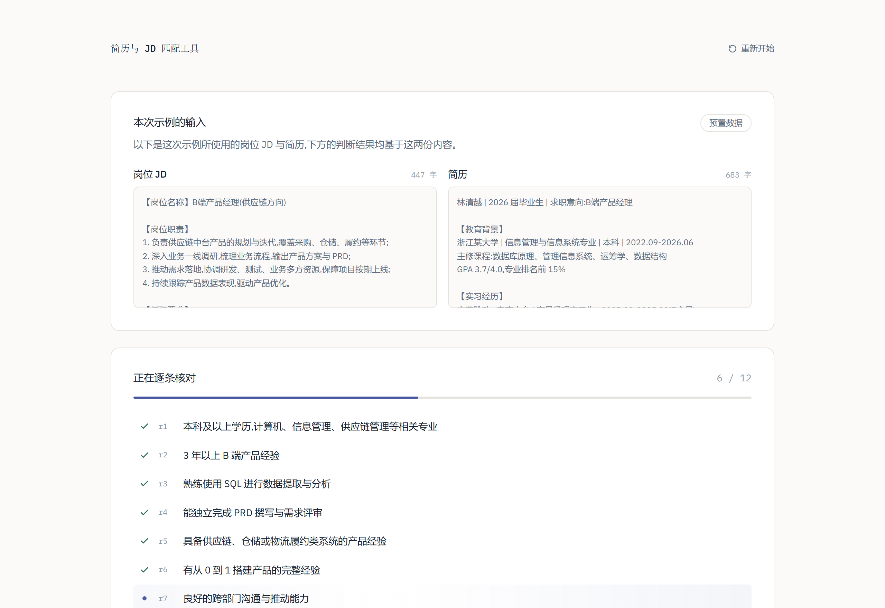
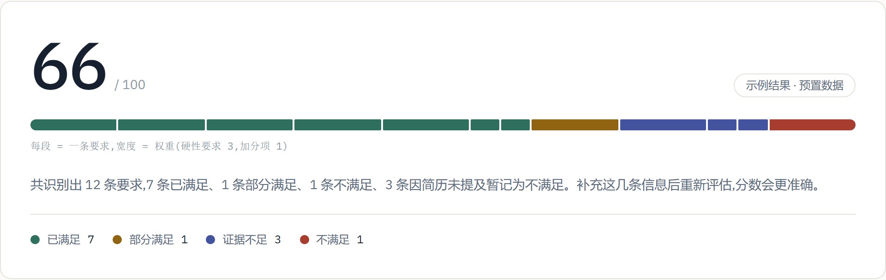
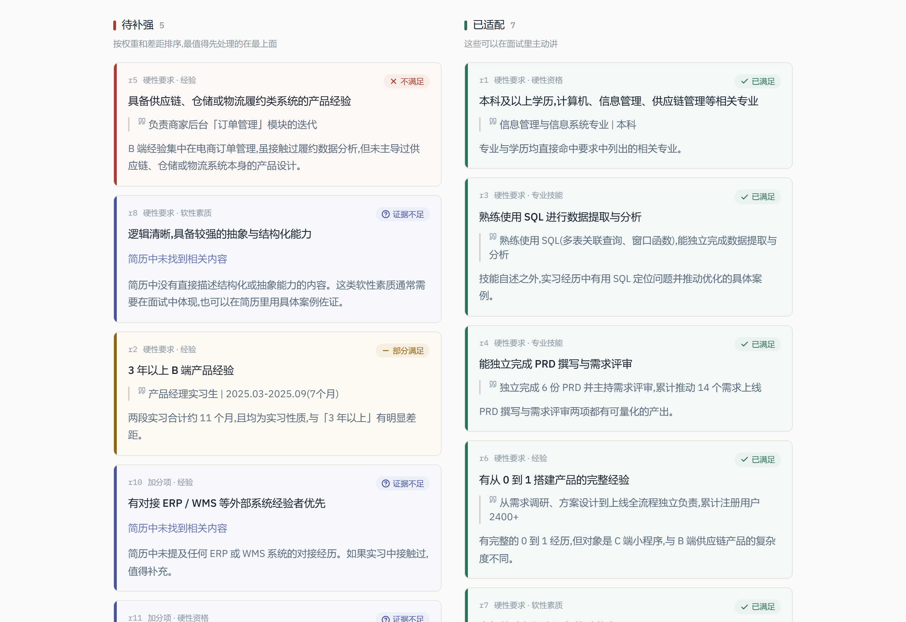
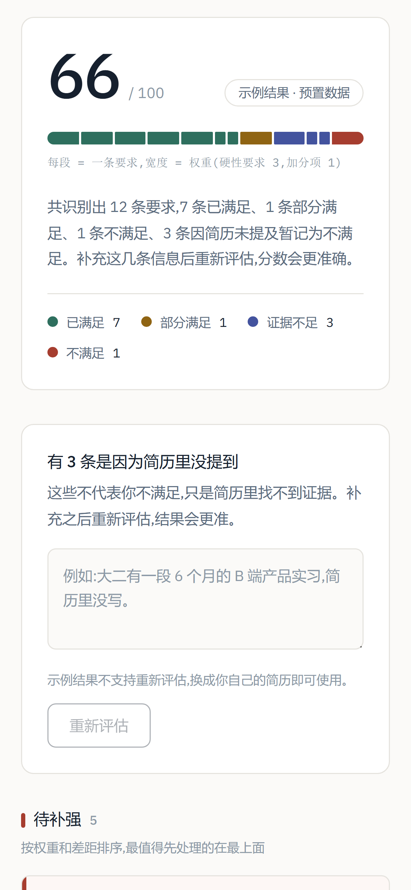

# 简历与 JD 匹配工具

把岗位 JD 拆解成一条条独立的任职要求,逐条核对简历是否满足,输出匹配度与差距清单。
**每条判断都标注证据来源与置信度;匹配度由固定权重规则计算,结果可复现。**

在线体验:[resume-jd-matcher-kappa.vercel.app](https://resume-jd-matcher-kappa.vercel.app)
> ⚠️ 部署在 Vercel(海外),国内网络访问不畅。下面的截图覆盖了完整流程,不必访问也能看懂。

---

## 长什么样

**首页 —— 判断结果分为四类**


**分析中 —— 进度是真实的**

第一步先把 JD 拆成要求清单,第二步才逐条判断。所以「正在核查第 6 条」对应的确实是模型此刻在处理的那一条,不是前端写死的动画。



**分数 —— 看得见它是怎么算出来的**

横条每一段是一条要求,**段的宽度就是这条要求的权重**(硬性要求 3,加分项 1),颜色是判断结果。不需要读任何说明,就能看出为什么少满足一条硬性要求扣得更多。



**逐条判断 —— 每条都有出处**



**移动端**



---

## 三个核心主张

### 1. 分数由规则算,不由模型给

模型只判断每条要求「满足 / 部分满足 / 不满足」+ 置信度,**总分由代码里的加权公式算出**。

为什么:让模型直接给总分,同一份简历刷新两次可能 73 分变 68 分,产品可信度当场崩塌。规则算分保证同样输入必然同样输出,而且能回答「为什么是 66 分」。

这是「**把确定性的计算交给规则,把模糊判断交给模型**」的一次具体落地。

### 2. 判断必须有出处

每条判断都要附上简历里的原文片段。找不到证据时,系统**明说「证据不足」**,而不是硬编一个体面的分数糊弄过去。

### 3. 「没写」不等于「没有」

简历里找不到证据的要求单独归为一类,用**靛蓝色**而不是警告色标注 —— 它不是错误,是信息缺失。用户补充后可以重新评估,分数会更准。

这条让整个产品闭环成立:分数偏低 → 看到原因是没写 → 有动力补充 → 重新评估。

---

## 一次真实的 prompt 改进

上线后用真实模型跑测,发现一个系统性误判,记录在此:

**问题**:要求「逻辑清晰,具备较强的抽象与结构化能力」被判为「部分满足」。但模型自己在备注里写着:

> 有结构化设计指标体系和独立负责项目的经历,但**缺乏直接体现抽象能力的证据,需推断**。

模型承认是推断,却仍给了正面判断。软性素质(沟通、逻辑、抗压)在简历里几乎从不会有直接陈述,这类要求会被**系统性高估**,分数虚高。

**根因**:prompt 里 `medium` 置信度的定义写的是「有相关证据,但存在明确差距,**或需要推断**」—— 是规则本身允许了推断,不是模型不听话。

**改进**:把「需要推断」整个划归 `low`,并加了一条自检规则:

> 如果你打算在 note 里写「可以推断」「体现出」「说明其具备」,那这条的 confidence 就是 "low",没有例外。

**复测**(同一份输入):

| 要求 | 改之前 | 改之后 |
|---|---|---|
| 良好的跨部门沟通与推动能力 | 已满足 | **证据不足** |
| 逻辑清晰、抽象与结构化能力 | 部分满足 | **证据不足** |
| 匹配度 | 66 | **55** |

分数下降是正确的 —— 虚高的那 11 分本来就建立在推断之上。

---

## 技术结构

```
浏览器
  ├─ pdf.js 解析简历 PDF → 纯文本(文件不离开浏览器)
  └─ POST /api/analyze
        ├─ IP 限流
        ├─ 第一步:从 JD 抽取要求清单(结构化,非流式)
        └─ 第二步:逐条比对简历(流式,一条一条返回)
              └─ 前端边收边渲染 → 规则算分
```

Next.js 16 · TypeScript · Tailwind CSS 4 · DeepSeek API

| 文件 | 作用 |
|---|---|
| [`src/lib/scoring.ts`](src/lib/scoring.ts) | 算分规则(纯函数,不含模型调用) |
| [`src/lib/pipeline.ts`](src/lib/pipeline.ts) | 两步 pipeline 与 prompt |
| [`src/lib/pdf.ts`](src/lib/pdf.ts) | 浏览器端 PDF 解析 |
| [`src/app/api/analyze/route.ts`](src/app/api/analyze/route.ts) | 流式接口 |

**完整设计文档:[`docs/design.md`](docs/design.md)** —— 10 项核心决策,每项都写了理由和被否决的方案。

---

## 隐私

- 简历 PDF **在浏览器本地解析**,文件从不上传,只有提取出的纯文本被发送用于分析
- 后端**无状态、无数据库**,分析完即丢弃,不存储任何用户数据

---

## 本地运行

```bash
npm install
cp .env.example .env.local   # 然后填入你自己的 DeepSeek API key
npm run dev
```

首页的**示例用的是预置数据,不需要 API key** 也能完整演示。

---

## 已知局限

- **限流是软门槛**:进程内内存计数,serverless 多实例下各算各的。足够拦住顺手多点几次,拦不住刻意刷。换成 Redis / Vercel KV 只需改 `src/lib/rate-limit.ts` 里的两个函数。
- **扫描件 PDF 提取不出文字**:已做诚实降级 —— 检测到提取为空时提示用户粘贴文本,而不是假装解析成功。
- **不存数据,因此没有线上真实判断数据**:评估依靠自建评估集(手工标注简历 × JD 组合,统计准确率与误判类型)。上面那次 prompt 改进就是这么发现的。
